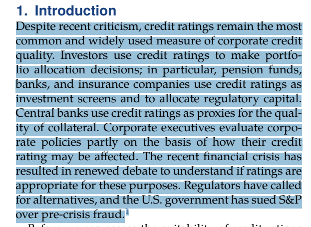
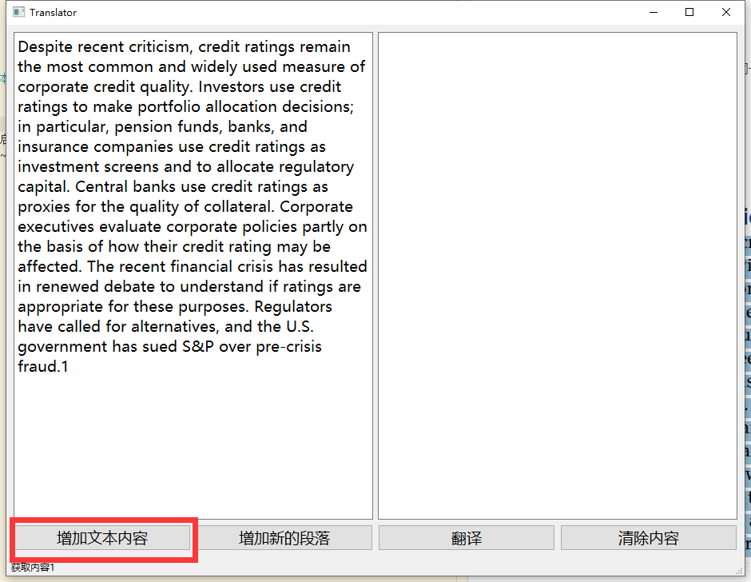
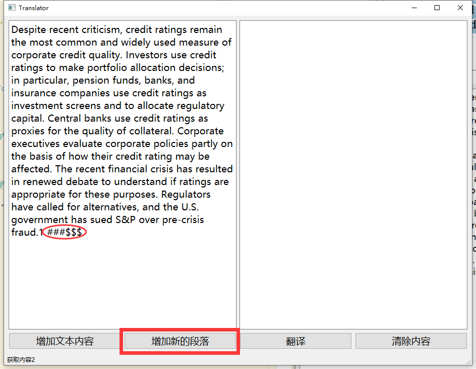
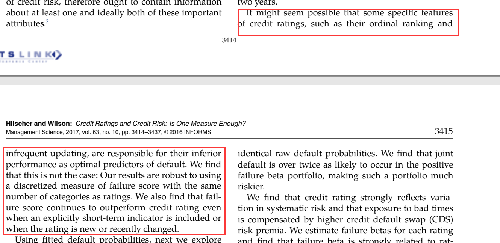
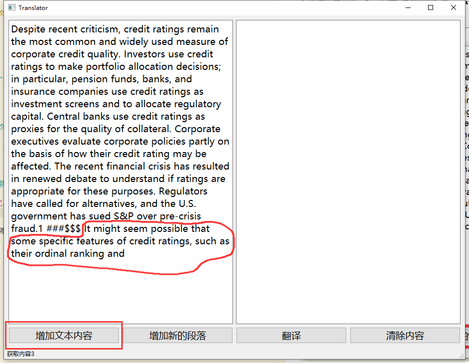
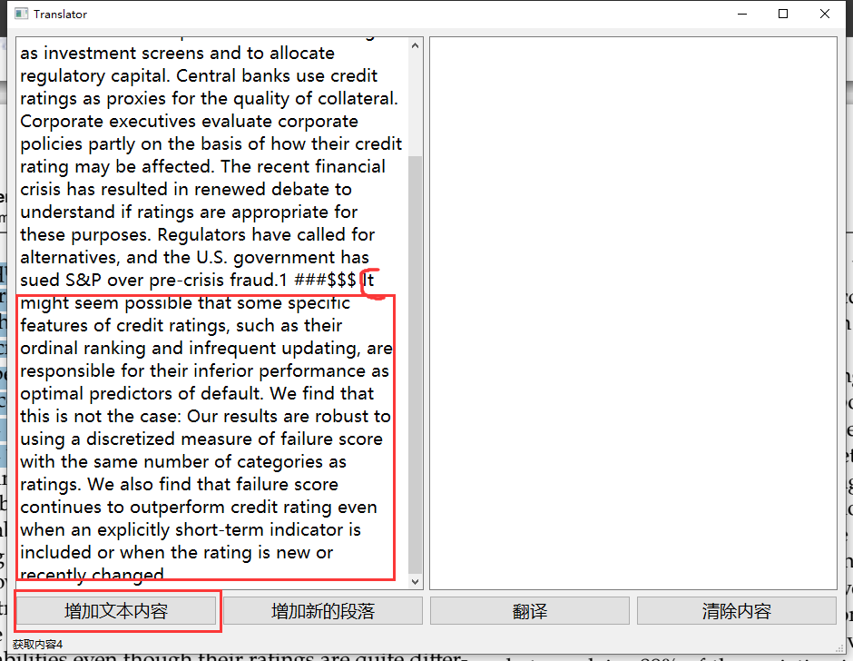
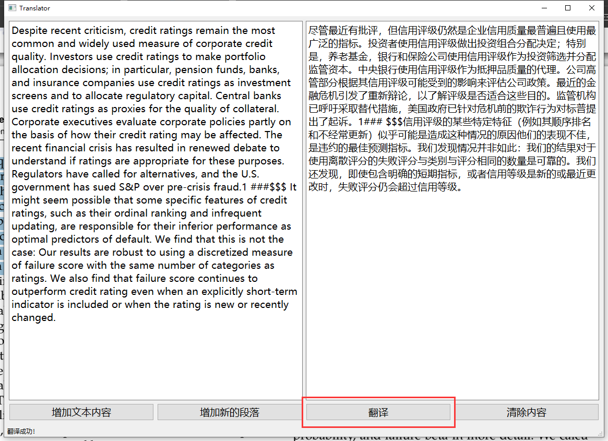
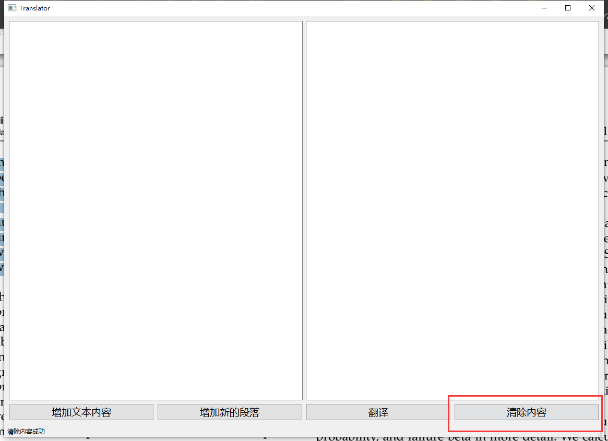

# 科研论文翻译小工具
## 1. 功能
- 自动处理换行符，可处理横跨多页面的同一段文本，爬取google翻译之后的内容。
- 可同时翻译多段内容

## 2. 使用方法
**1. 复制需要翻译的文本；**

**2. 点击“增加文本内容”**

**3. 如果想要新加一段，点击“增加新的段落”，会在待翻译文本中添加占位置的特殊符号（能分清楚不同段落就行了，要求别太高哈。。。）**

**4. 如果遇到横跨多页的文本，分别复制文本之后直接继续点击“增加文本内容”即可（复制一次点一次“增加”噢）；**

**5. 然后点击“翻译”**

**6. 翻译完成之后记得点击“清除内容”**

## 3. 你可能会遇到的问题
- **遇到闪退情况是与google服务器连接超时，重启即可。**
- **反正遇到问题重启就行了**

## 4. 关于EXE文件
- **EXE文件不需要依赖可独立在Windows平台上运行**
- **EXE文件在dist文件夹。**

## 和google网页版翻译一模一样，亲测很好用哦， 奥利给~~